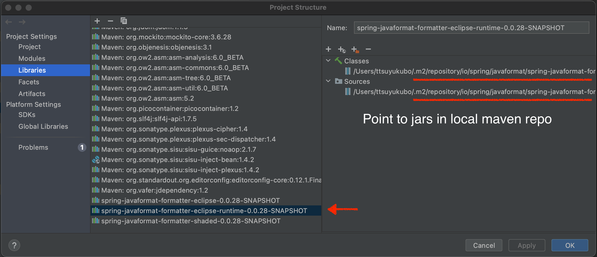
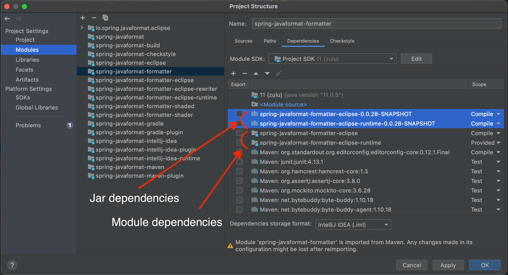
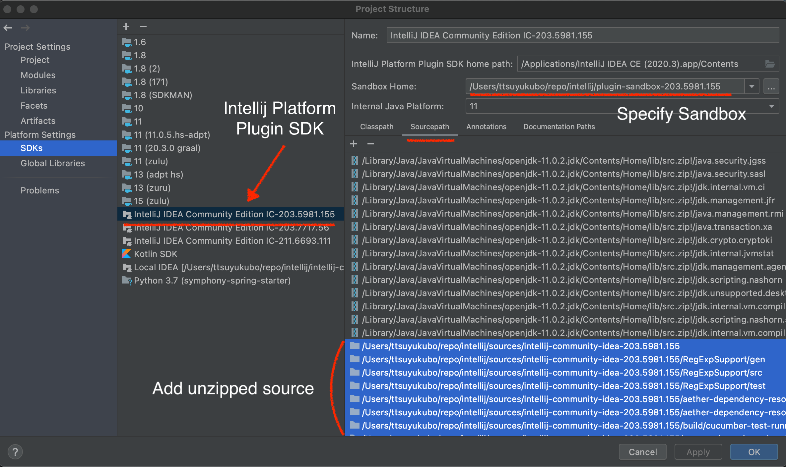
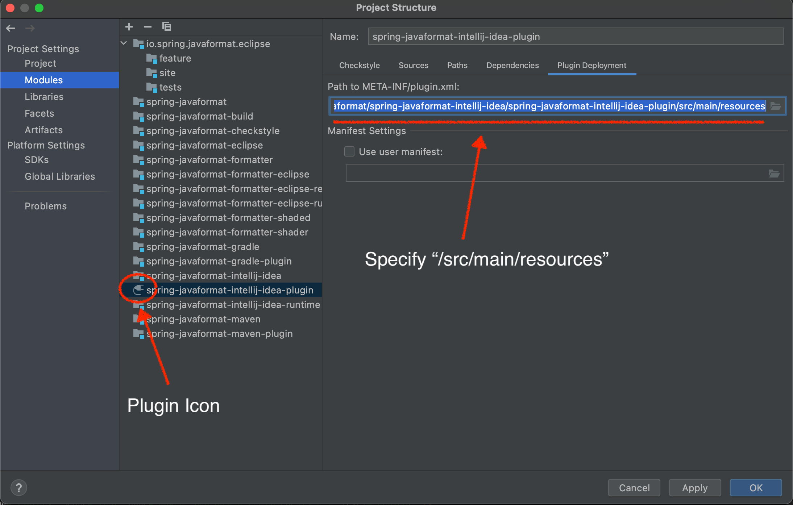

= Contributing to Spring Java Format

Spring Java Format is released under the Apache 2.0 license.
If you would like to contribute something, or simply want to hack on the code this document should help you get started.

== Code of Conduct
This project adheres to the Contributor Covenant link:CODE_OF_CONDUCT.adoc[code of conduct].
By participating, you are expected to uphold this code.
Please report unacceptable behavior to spring-code-of-conduct@pivotal.io.

== Sign the Contributor License Agreement
Before we accept a non-trivial patch or pull request we will need you to https://cla.pivotal.io/sign/spring[sign the Contributor License Agreement].
Signing the contributor's agreement does not grant anyone commit rights to the main repository, but it does mean that we can accept your contributions, and you will get an author credit if we do.
Active contributors might be asked to join the core team, and given the ability to merge pull requests.

== Working with the code
If you don't have an IDE preference we would recommend that you use
https://spring.io/tools/sts[Spring Tools Suite] or
https://eclipse.org[Eclipse] when working with the code. We use the
https://eclipse.org/m2e/[M2Eclipse] eclipse plugin for maven support. Other IDEs and tools
should also work without issue.

=== Building from source
To build the source you will need to install JDK 11.

==== Default build
The project can be built from the root directory using the standard maven command:

[indent=0]
----
	$ ./mvnw clean install
----

NOTE: You may need to increase the amount of memory available to Maven by setting a `MAVEN_OPTS` environment variable with the value `-Xmx512m`

=== Importing into eclipse
You can import the code into any Eclipse based distribution as long as it had the https://eclipse.org/m2e/[M2Eclipse] eclipse plugin.
If you don't already have m2eclipse installed it is available from the "Eclipse marketplace".

Once imported, you can apply eclipse settings by running:

[indent=0]
----
	$ ./mvnw -Peclipse validate
----

NOTE: You'll need to close the `spring-javaformat-formatter-eclipse` and `spring-javaformat-formatter-eclipse-runtime` projects following import since they contain rewritten packages that aren't supported by the IDE

=== Importing into IntelliJ IDEA

You can import the code as a maven project into IntelliJ IDEA.

==== Module dependencies

When IntelliJ IDEA parses `pom.xml`, it automatically creates inter-module dependencies if dependent libraries are coming from other modules within the project.
However, when dependent modules perform repackaging (e.g. `spring-javaformat-formatter-eclipse-runtime` module), the current module cannot resolve all classes by module dependencies because repackaging(shade & binary manipulation) moves around classes.
Therefore, you need to manually update the dependencies from the module to the produced jars.

Following modules perform repackaging.

* `spring-javaformat-formatter-eclipse`
* `spring-javaformat-formatter-eclipse-runtime`

Modules that depend on these modules need jar dependencies instead of module dependencies.

===== Setting up jar dependencies

The following steps define jar-based project libraries on IDE and add them to the modules that need jar dependencies.

*Add a jar file-based project library*

* "Project Settings" -> "Libraries"
* Click "+" sign, then select "Java"
* Specify the jar file +
For example, you can specifie the jar file in the target directory(`<PROJECT>/spring-javaformat/spring-javaformat-formatter-eclipse-runtime/target/spring-javaformat-formatter-eclipse-runtime-0.0.28-SNAPSHOT.jar`)
or one in the local maven repository(`~/.m2/repository/io/spring/javaformat/spring-javaformat-formatter-eclipse-runtime/0.0.28-SNAPSHOT/spring-javaformat-formatter-eclipse-runtime-0.0.28-SNAPSHOT.jar`).

*Add library dependencies to modules*

* "Project Settings" -> "Modules"
* Select a module that depends on repackaging modules
* Click "+" sign and "2 Library"
* "Choose Libraries" and select necessary libraries that have added in the previous step
* Move up the added libraries higher than the module dependencies (or remove the module dependencies)

=== Setting up IntelliJ IDEA plugin development

==== Download images

To develop the `spring-javaformat-intellij-idea-plugin` module, you need an IntelliJ IDEA application on your local machine.

* Open the `pom.xml` in `spring-javaformat-intellij-idea/spring-javaformat-intellij-idea-runtime`.
* Check `intellij.binary` and `intellij.source` properties to find out the appropriate IntelliJ IDEA version.
* Download the binary from the url in `intellij.binary`.  +
(For OSX, replace the `.tar.gz` to `.dmg` to download the image file.)
* Install the image to the local machine
* Download the source files from github specified in `intellij.source` and unzip it.

==== Setup SDK

* Open "Project Structure" - "Platform Settings" - "SDKs"
* Click "+" sign, "Add Intellij Platform Plugin SDK..."
* Specify the installed intellij image.  (`/applications/IntelliJ IDEA CE` for OSX)
* On the right panel, "Sourcepath", Click "+" sign, specify unzipped intellij source directory
* Specify "Sandbox Home" directory

Please see the https://plugins.jetbrains.com/docs/intellij/setting-up-environment.html[IntelliJ IDEA reference] for how to setup a plugin development in details.

==== Convert to Plugin Module

The imported `spring-javaformat-intellij-idea-plugin` module is recognized as a java module.
This needs to be converted to a plugin module.

* Open `spring-javaformat-intellij-idea-plugin.iml` in `spring-javaformat-intellij-idea/spring-javaformat-intellij-idea-plugin`
* Change `type="JAVA_MODULE"` to `type="PLUGIN_MODULE"`
+
[indent=0,xml]
----
<module org.jetbrains.idea.maven.project.MavenProjectsManager.isMavenModule="true" type="PLUGIN_MODULE" version="4">
----
+
Reference https://stackoverflow.com/questions/18278440/how-to-import-and-run-existing-plugins-from-intellij-community-edition-repo[how to convert existing module to a plugin module]

* Open "Project Structure" - "Modules"
* Check `spring-javaformat-intellij-idea-plugin` icon turns to a plugin icon
* "Plugin Deployment" - "Path to META-INF/plugin.xml"
* Specify `<PROJECT>spring-javaformat/spring-javaformat-intellij-idea/spring-javaformat-intellij-idea-plugin/src/main/resources`

=== Setting up Gradle plugin development

`spring-javaformat-gradle-plugin` module is a gradle plugin and requires gradle related classes.

To add gradle classes, convert this module to a gradle project.

* On the project pain, right-click `build.gradle` in `spring-javaformat-gradle-plugin` module
* Select "Import Gradle Project"

=== Importing into other IDEs
Maven is well supported by most Java IDEs. Refer to your vendor documentation.

== Understanding the code
There are quite a few moving parts to this project and the build is quite complex.
At the top level there are 5 projects:

* `spring-javaformat` - The main formatter project
* `spring-javaformat-eclipse` - The Eclipse plugin
* `spring-javaformat-gradle` - The Gradle plugin
* `spring-javaformat-intellij` - The IntelliJ IDEA plugin
* `spring-javaformat-maven` - The Maven plugin

Under `spring-javaformat` the following projects are defined:

* `spring-javaformat-checkstyle` - The checkstyle plugin
* `spring-javaformat-formatter` - The main formatter code
* `spring-javaformat-formatter-eclipse` - The eclipse formatter (repackaged and slightly adapted)
* `spring-javaformat-formatter-eclipse-rewriter` - Internal utility used to modify eclipse code
* `spring-javaformat-formatter-eclipse-runtime` - Eclipse runtime JAR for use when running outside of Eclipse

The main formatter is based on the formatter included with Eclipse.
The shade plugin is used to repackage the formatter code to ensure that it doesn't clash with the real one when used in the Eclipse plugin.
A small amount of bytecode modification is also applied that increase the visibility of a few methods.

When the formatter runs outside of Eclispe some eclipse runtime files are also needed.
The `spring-javaformat-formatter-eclipse-runtime` project uses proguard to build a minimal eclipse runime jar.
