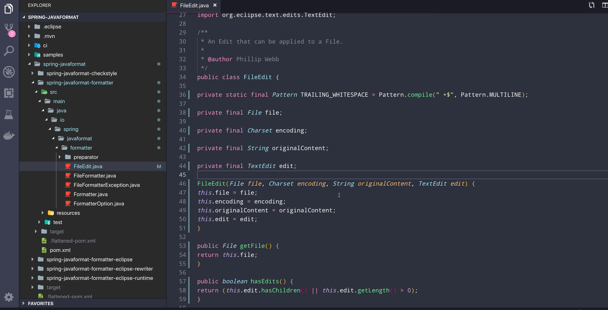

# spring-javaformat-vscode

`spring-javaformat` extension for visual studio code.

## Prerequisites

* Install [node.js](https://nodejs.org/en/download/)
* Install [yarn](https://yarnpkg.com/en/docs/install)
* Install [vsce](https://code.visualstudio.com/api/working-with-extensions/publishing-extension#vsce)

## Generate extension

Just `mvn clean package`

> `spring-javaformat-1.0.0.vsix` will be generated there

